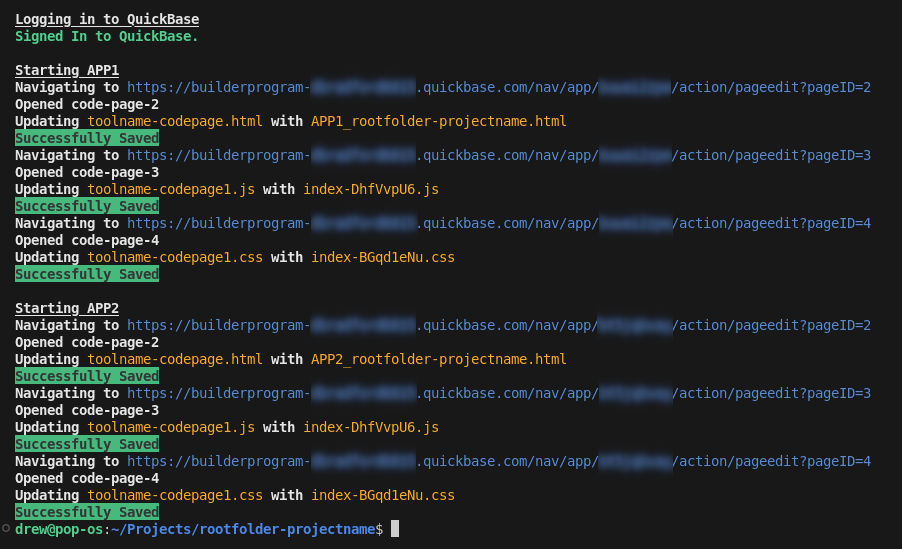

# quickbase-codepages

## Description

Building custom UI's deployed in QuickBase can be challenging. Its important to be able to quickly run tests and deploy to code pages easily in multiple enviornments. Copy and pasting into code pages is time consuming and error prone.

This library alleviates this problem by automatically updating code pages in multiple enviornments when you run `npm run codepages`. It also sets up a QuickBase ready project structure with pre-formatted HTML files specifically targetting each enviornment, linking its CSS and JS code pages automatically when you run `npm run dev`.



## Prerequisites

- Node.js version 16.x or higher is recommended.
- A QuickBase account. A free [builder account](https://www.quickbase.com/builder-program) will work.

## Install

```bash
npm install quickbase-codepages --save-dev
```

## Uninstall

```bash
npx uninstall-quickbase-codepages
```

## Use

`npm run codepages`

Update code pages with files in your `./dist` folder.

- Terminal messages display the matching behavior of code pages to production files so you can see what is being saved.

> **Note:** To update multiple apps, see the `codepages-config.js` section below.

`npm run build`

Generates a project structure ready for `npm run codepages` so you don't have to think about details.

- Generates a set of HTML files for each app you wish to update in your project's ./dist folder.

  - To turn off, remove `&& createCodePageHtml` in package.json.

- Move `index.html` to ./dist/unused/.

  - To turn off, remove `&& hideDefaultHtml` in package.json.

## Required: Configuration File

This project requires a `codepages-config.js` file in your project root to define QuickBase settings.

### Create `codepages-config.js`:

- Place this file in your project root.
- Define your QuickBase credentials and app configurations.

### Configuration Options

- **`username`:**

  - Your QuickBase username.

- **`password`:**

  - Your QuickBase password.

- **`quickbaseLoginUrl`:**

  - Logout to get the sign-in URL for QuickBase.
  - Example: `https://builderprogram-USERNAME.quickbase.com/db/main?a=SignIn`

#### App Options

For each app under `apps` (e.g., MYAPP1, MYAPP2 etc):

- **`quickbaseCodepagesUrl`:**

  - Navigate to the Pages section in your app. This is the page that lists all your code pages.
  - Example: `https://builderprogram-USERNAME.quickbase.com/nav/app/DBID/action/AppDBPages`

- **`quickbaseCodepageEditUrl`:**

  - The URL when you navigate to an individual code page.
  - Example: `https://builderprogram-USERNAME.quickbase.com/nav/app/DBID/action/pageedit?pageID=`

- **`quickbaseHtmlPageTitle`:**

  - The HTML `<title></title>` for the generated HTML code page.
  - Example: `Page Title`

- **`quickbaseCodepageHtmlId`:**

  - The HTML code page ID (optional; set to "" to skip updating).
  - Example: `2`

- **`quickbaseCodepageJsIds`:**

  - Array of JavaScript code page IDs (e.g., ["6", "7"]).

- **`quickbaseCodepageCssIds`:**

  - Array of CSS code page IDs (e.g., ["8"]).

### Example `codepages-config.js` File

See `codepages-config.js` in the project files. You may use this as a template.

> **Note:** You can load environment variables however you prefer (e.g., dotenv, process.env, custom logic). Remember to add sensitive information to your .gitignore. This example is provided as a reference.

```javascript
// codepages-config.js

export default {
  // QuickBase login
  username: EXAMPLE_ENV_QB_USERNAME || "your-username",
  password: EXAMPLE_ENV_QB_PASSWORD || "your-password",
  quickbaseLoginUrl:
    "https://builderprogram-USERNAME.quickbase.com/db/main?a=SignIn",
  apps: {
    // Rename 'MYAPP1' to your app name.
    MYAPP1: {
      quickbaseCodepagesUrl:
        "https://builderprogram-USERNAME.quickbase.com/nav/app/DBID/action/AppDBPages",
      quickbaseCodepageEditUrl:
        "https://builderprogram-USERNAME.quickbase.com/nav/app/DBID/action/pageedit?pageID=",
      quickbaseHtmlPageTitle: "My App 1",
      quickbaseCodepageHtmlId: "5",
      quickbaseCodepageJsIds: ["6", "7"],
      quickbaseCodepageCssIds: ["8"],
    },
    // Additional apps are optional.
    // Rename 'MYAPP2' to your app name.
    MYAPP2: {
      quickbaseCodepagesUrl:
        "https://builderprogram-USERNAME.quickbase.com/nav/app/DBID/action/AppDBPages",
      quickbaseCodepageEditUrl:
        "https://builderprogram-USERNAME.quickbase.com/nav/app/DBID/action/pageedit?pageID=",
      quickbaseHtmlPageTitle: "My App 2",
      quickbaseCodepageHtmlId: "9",
      quickbaseCodepageJsIds: ["10", "11"],
      quickbaseCodepageCssIds: ["12"],
    },
    // Adding more apps follow this pattern...
  },
};
```

## Contributing

If you would like to contribute to this project, please fork the repository and submit a pull request.

## License

This project is licensed under the MIT License.
